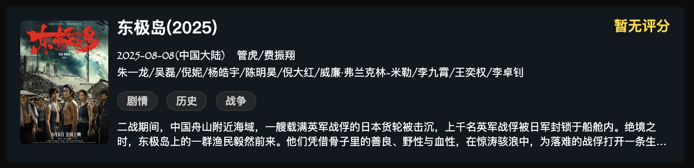

# 介绍信息
这个项目是一个介绍自己的微型简历网站，你可以 ``fork template 分支``去做自己想要的东西

# 在线地址(由于国情，现已被墙)
[在线地址](https://self-me.vercel.app/#/terminal)
# 切换新地址 
[新地址](https://self-udpn.netlify.app/self/#/index)


[](https://app.netlify.com/projects/self-udpn/deploys)

# features
- 2025-10-23
> 支持了根据markdown 生成 电影卡片功能集成
> 定义了doubanSchema 数据支持以下``类型`` 获取
- 语法
```txt

`````up-电影卡片
|  "导演": "管虎/费振翔",
|  "编剧": "陈舒/董润年/张冀/费振翔/周晨",
|  "主演": "朱一龙/吴磊/倪妮/杨皓宇/陈明昊/倪大红/威廉·弗兰克林-米勒/李九霄/王奕权/李卓钊",
|  "类型": "剧情/历史/战争",
|  "制片国家/地区": "中国大陆",
|  "语言": "汉语普通话/英语/日语",
|  "上映日期": "2025-08-08(中国大陆)",
|  "片长": "133分钟",
|  "又名": "东极大营救/DongjiIsland/DongjiRescue",
|  "IMDb": "tt32634271",
|  "剧情简介": "二战期间，中国舟山附近海域，一艘载满英军战俘的日本货轮被击沉，上千名英军战俘被日军封锁于船舱内。绝境之时，东极岛上的一群渔民毅然前来。他们凭借骨子里的善良、野性与血性，在惊涛骇浪中，为落难的战俘打开一条生路。<br /><br />取材自中国渔民营救英军战俘的真实事件。",
|  "影片名称": "东极岛(2025)",
|  "评分": "暂无评分",
|  "影片海报": "https://img3.doubanio.com/view/photo/s_ratio_poster/public/p2922389852.jpg",
|  "id": "26660874",
|  "影片地址": "https://movie.douban.com/subject/26660874/"
`````" (ps:这个引号可以去掉)

```


- 生成结果

