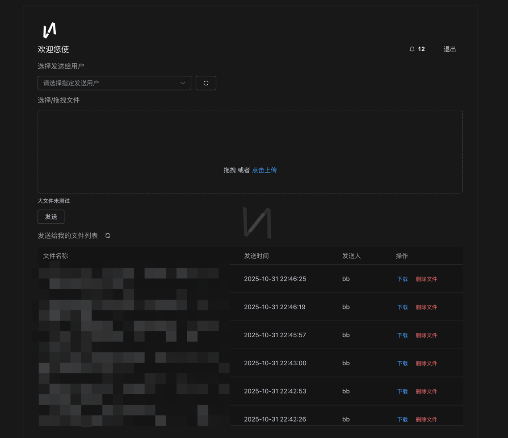

> 2025年10月29日我用 ```up-keyword Node``` 和 ```up-keyword vue3``` 写了一个 ```up-keyword 局域网文件传输工具```

> 取名叫做 Tran

 

```up-br
```

暂时实现的功能有：

```up-br
```
- ```up-keyword 文件发送``` 

```up-br
```

- ```up-keyword 文件下载及删除```

```up-br
```

- ```up-keyword 用户登录及注册``` 

```up-br
```

技术栈：```up-keyword Node Express``` ```up-keyword Vue3``` ```up-keyword WebSocket ```


